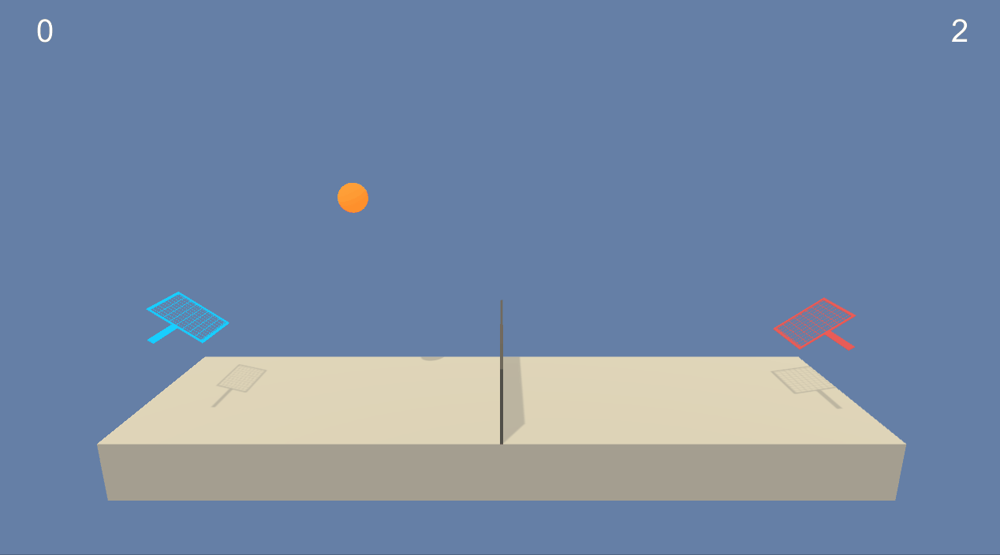

# MARLCollaborationAndCompetition-DRLND

The code is based on materials from Udacity Deep Reinforcement Learning Nanodegree Program.

## Project Details

The repository contains the solution for the multi-agent learning project at Udacity DRLND program. Multi-agent project aims to teach how to construct reinforcement frameworks around environments with several agents that need to collaborate to achieve a shared objective or compete.

As a multi-agent environment, we took Tennis Unity-ML environment. In this environment, two agents control rackets to bounce a ball over a net. If an agent hits the ball over the net, it receives a reward of +0.1. If an agent lets a ball hit the ground or hits the ball out of bounds, it gets a reward of -0.01. Thus, the goal of each agent is to keep the ball in play.

The observation space consists of 8 variables corresponding to the position and velocity of the ball and racket. Each agent receives its own, local observation. Two continuous actions are available, corresponding to the movement toward (or away from) the net, and jumping.

The task is episodic, and to solve the environment, the agents must get an average score of +0.5 (over 100 consecutive episodes)

The environment was solved using MADDPG (Multi-Agent Deep Deterministic Policy Gradient) algorithm.

## Getting Started

You will not need to install Unity, just install agent by following the link below:

* [Linux](https://s3-us-west-1.amazonaws.com/udacity-drlnd/P3/Tennis/Tennis_Linux.zip)
* [Linux terminal version](https://s3-us-west-1.amazonaws.com/udacity-drlnd/P3/Tennis/Tennis_Linux_NoVis.zip)
* [Mac OSX](https://s3-us-west-1.amazonaws.com/udacity-drlnd/P3/Tennis/Tennis.app.zip)
* [Windows (32-bit)](https://s3-us-west-1.amazonaws.com/udacity-drlnd/P3/Tennis/Tennis_Windows_x86.zip)
* [Windows (64-bit)](https://s3-us-west-1.amazonaws.com/udacity-drlnd/P3/Tennis/Tennis_Windows_x86_64.zip)
  

To train the model or inference provided weights install the following python packages:

* pytorch
* unityagents
* numpy
* matplotlib

## Instructions
Since the repository provides jupyter notebooks, follow the steps of execution.