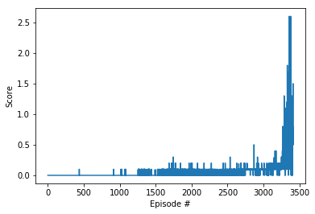

# Report 
The report is based on materials from Udacity Deep Reinforcement Learning Nanodegree Program.

## Learning Algorithm
The multi-agent systems are everywhere around us

Agents may or may not know anything about the others in the system. The multi-agent case is a complex type of environment because all the agents are learning simultaneously and also interacting with one another. 

We can frame multi-agent in single agent system in two ways:
1. Train all agents independently without considering existing of other agents. In this case, each agent considers other to be a part of an environment and learn its policy. The environment changes dynamically (Non-Stationality). Stationarity is a condition to guarantee the convergence.

1. Meta-agent approach. It takes into account the existence of multiple agents and single policy is learned for all the agents. It takes the current state of the environment an outputs actions for all the agents. There is a single reward return. This approach is difficult to implement when the environment is partially observable since each agent gets a local copy of the environment. It only works when each agent knows everything about the environment. 

Benefits of using multi-agent instead of the single-agent system:
Each agent collects information and share experience with one another. 

**Markov Game Framework**

* Markov game is a tuple written like this:

* State transition is Markovian as in case of MDP (next state only depends on the present state and the action taken in the current state)

I modified a standard DDPG algorithm to solve the environment in a multi-agent way. I implemented two DDPG agents that have its critic and actor-network. The agents have shared experience.

## Hyperparameters

It was fun to finetune the hyperparameters while working on the Tennis environment with MADDPG algorithm. I received the fastest learning with the Actor and Critic having 3 layers (fc1_units=128, fc2_units=128). The Actor uses Relu activation on the first two and tanh on the final layer. The Critic uses Relu on the first two layers only.

The following hyperparameters I used while training the agent:
Hyperparameter | Value
------------ | -------------
replay buffer size | int(1e5)
minibatch size | 128
discount factor | 0.99
for the soft update of target parameters | 1e-3
The learning rate of the actor | 1e-4
The learning rate of the critic | 1e-4

## Plot of Rewards

The environment considered as being solved if an agent would get an average of +0.5 reward over 100 consecutive episodes.

The results of my tunning are 3412 episodes to attain an average score of 0.5.

## Ideas for Future Work

I plan to implement PER (Priority Experience Replay) memory buffer and OpenAI Five architecture. 